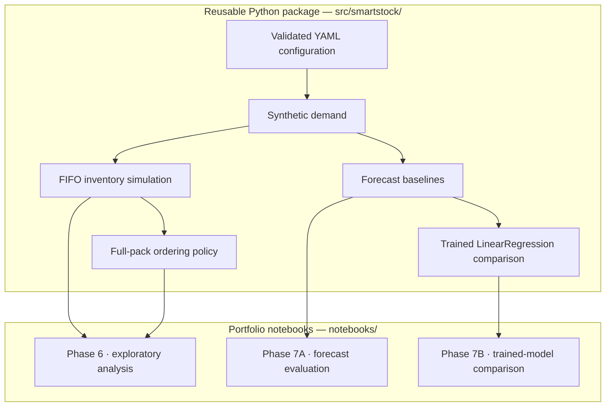

# SmartStock ML

SmartStock ML is a privacy-safe Python project that simulates inventory, evaluates
ordering policies, and compares leakage-safe demand-forecasting methods using
deterministic synthetic data.

[](https://github.com/sebass369/smartstock-ml/actions/workflows/tests.yml)

**Recommended starting point — Phase 7B, the trained-model comparison:**
[](https://colab.research.google.com/github/sebass369/smartstock-ml/blob/main/notebooks/phase_7b_machine_learning.ipynb)

Also runnable in one click — Phase 6 exploratory analysis
[](https://colab.research.google.com/github/sebass369/smartstock-ml/blob/main/notebooks/phase_6_exploratory_analysis.ipynb)
and Phase 7A forecast baselines
[](https://colab.research.google.com/github/sebass369/smartstock-ml/blob/main/notebooks/phase_7_forecasting.ipynb)

## Overview

Inventory is replenished on a fixed 14-day delivery cycle, and demand varies by
weekday across nine anonymous product aliases. Ordering too little produces
simulated unmet demand and stockout events. Ordering too much leaves inventory
exposed to expiration. This repository builds a deterministic synthetic dataset
for that situation and uses it to evaluate transparent ordering policies and
leakage-safe demand-forecasting methods.

Every record here is synthetic. Demand is generated from validated YAML
configuration and a fixed random seed, and no real sales, delivery, or
operational data is used anywhere in the project.

## How It Works



Every rule lives in the reusable package: configuration validation, seeded
demand generation, FIFO cohorts with expiration, full-pack rounding, the
forecast chronology, and the model pipeline. The notebooks import that code and
present it; they contain no business logic.

## Key Results

| Measure | Value |
| --- | --- |
| Simulated days | 56 |
| Approved anonymous product aliases | 9 |
| Synthetic daily demand records | 504 |
| Chronological forecast origins | 3 |
| Product-cycle forecast records | 27 |
| Previous-cycle baseline — MAE / WAPE | 3.4074074074074074 demand units / 6.375606375606376 percent |
| Expanding weekday-mean candidate — MAE / WAPE | 3.462962962962963 demand units / 6.4795564795564795 percent |
| Trained LinearRegression — MAE / WAPE | 3.462962962962963 demand units / 6.4795564795564795 percent |
| LinearRegression vs. weekday-mean candidate | 0 wins / 9 ties / 0 losses — an exact tie for every product |
| LinearRegression vs. previous-cycle baseline | 5 wins / 0 ties / 4 losses per product; loses on aggregate MAE |
| Fixed delivery scenario | 0 unmet demand units, 0 stockout events, 0 waste units |
| Baseline ordering-policy scenario | 36 unmet demand units, 12 stockout events, 0 waste units |

The trained model does not beat the naive previous-cycle baseline on aggregate
MAE, and it reproduces the weekday-mean candidate exactly. That negative result
is intentional and informative rather than a defect: every training and target
window in this dataset contains each weekday an equal number of times, so
summing 14 daily least-squares estimates returns 14 times a product's
pre-origin mean demand, which is precisely what the weekday-mean candidate
already computes. What the comparison demonstrates is a correct chronological
evaluation — refitting at each origin, an executable leakage boundary, and
identical evaluation records for all three methods — rather than an exaggerated
machine-learning claim.

The two ordering scenarios are reported side by side as a tradeoff, not a
ranking. The policy scenario orders fewer units and holds less ending inventory,
and it also produces more unmet demand and more stockout events than the fixed
scenario.

Default expiration and waste are zero in both scenarios because the 56-day
horizon is shorter than every configured unopened shelf life and starting
inventory is fresh. Focused tests use shortened synthetic shelf lives to verify
the expiration boundary. No reduction in waste is claimed or demonstrated.

## Try It

The fastest path needs nothing installed. Open the
[Phase 7B notebook in Colab](https://colab.research.google.com/github/sebass369/smartstock-ml/blob/main/notebooks/phase_7b_machine_learning.ipynb),
select a fresh runtime, and run all cells. No credentials, uploads, Google Drive
connection, or external dataset is required.

To run everything locally, including the test suite:

```powershell
py -3.13 -m venv .venv
.\.venv\Scripts\python.exe -m pip install -e ".[dev,analysis,ml]"
.\.venv\Scripts\python.exe -m pytest -q
```

Smaller installs exist if you need only part of the project: `.[dev]` for the
tests, `.[dev,analysis]` for the Phase 6 and Phase 7A notebooks, and
`.[dev,ml]` for the Phase 7B model.

## Notebooks

- **Phase 7B — trained-model comparison (recommended first notebook):**
  [`notebooks/phase_7b_machine_learning.ipynb`](notebooks/phase_7b_machine_learning.ipynb)
  · [open in Colab](https://colab.research.google.com/github/sebass369/smartstock-ml/blob/main/notebooks/phase_7b_machine_learning.ipynb)
- **Phase 7A — baseline forecast evaluation:**
  [`notebooks/phase_7_forecasting.ipynb`](notebooks/phase_7_forecasting.ipynb)
  · [open in Colab](https://colab.research.google.com/github/sebass369/smartstock-ml/blob/main/notebooks/phase_7_forecasting.ipynb)
- **Phase 6 — exploratory analysis:**
  [`notebooks/phase_6_exploratory_analysis.ipynb`](notebooks/phase_6_exploratory_analysis.ipynb)
  · [open in Colab](https://colab.research.google.com/github/sebass369/smartstock-ml/blob/main/notebooks/phase_6_exploratory_analysis.ipynb)

## Repository Structure

| Path | Contents |
| --- | --- |
| `src/smartstock/` | Reusable package: configuration, generator, inventory, ordering, forecasting, model |
| `tests/` | Automated test suite |
| `config/` | Validated synthetic product, delivery, generation, inventory, and ordering settings — [index](config/README.md) |
| `docs/` | Technical contracts, data dictionary, and design decisions — [index](docs/README.md) |
| `notebooks/` | Colab demonstrations that import the package — [index](notebooks/README.md) |
| `data/` | Generated and sample directories; generated CSV files are ignored by Git — [index](data/README.md) |

The full project specification lives in [`PROJECT.md`](PROJECT.md).

## Engineering and Reproducibility

- Synthetic demand is generated with a local seeded generator. The default seed
  is `42`, and it is never a model-training seed.
- Forecasts are evaluated chronologically. The model is refitted independently at
  each of the three origins on 126, 252, and 378 strictly pre-origin rows, and
  `training_row_count` is re-derived during validation as an executable leakage
  audit.
- Model features are limited to two values known on the forecast origin date:
  the product alias and the target calendar weekday.
- Three golden SHA-256 anchors pin the Phase 3, Phase 4A, and Phase 4B CSV byte
  contracts against regression.
- GitHub Actions runs the full suite on Python 3.12 with read-only permissions,
  rejects tracked generated CSV files, and fails if tracked files change.
- 399 automated tests cover configuration, generation,
  inventory, ordering, forecasting, the model, notebook structure, and this
  README contract.
- The Phase 6 and Phase 7B notebooks pin immutable commit revisions for their
  Colab runs. Phase 7A intentionally tracks `main`.
- No generated dataset, serialized model, screenshot, or notebook output is
  tracked in Git.

## Privacy

All data is synthetic and limited to exactly nine anonymous product aliases. The
repository contains no employer, company, brand, store, employee, manager,
customer, or vendor identifier, no location or store number, and no real sales,
invoice, delivery, or other operational record. It contains no credentials,
tokens, private URLs, uploads, or screenshots. Donut products and donut waste
are excluded from Version 1.

## Limitations

- The dataset contains only 56 synthetic days.
- Evaluation uses only 3 forecast origins and 27 product-cycle records.
- `LinearRegression` on two calendar-known features is intentionally simple.
- Synthetic performance cannot establish real-world forecast accuracy, business
  impact, or operational benefit, and none is claimed.
- Default expiration and waste behavior is limited by the short simulation
  horizon, so the expiration path is exercised mainly by focused tests.
- The ordering-policy scenario demonstrates a stockout-versus-inventory tradeoff
  rather than an optimization result.

## Roadmap

- **Phase 8A — portfolio presentation.** Documentation, navigation, and
  discoverability only, with no change to analytical behavior.
- **Phase 8B — optional hosted, read-only dashboard.** Not implemented and not
  required.
- **Version 2 — separately approved future scope.** Any new product or data
  source needs its own approval.

## License

Released under the [MIT License](LICENSE).
